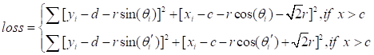
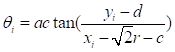
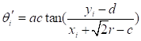
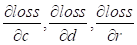
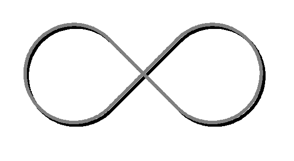

Target trajectory prediction by parametric equation.

We fitting the curve by the waypoint of the circle which is obtained by camera.

Then construct the loss function.

 

 

Where c, d is the position of the cross point of the trajectory in local coordinate, r is the radius of circle.

 , represent the polar angle.

Next, we calculate the jacobian matrix  and use Conjugate Gradient Method to calculate the c, d, r and solve the optimal problem.

 

Due to numerical iteration methods are sensitive to initial values, the solution will be trapped in a local optimal solution if we didn’t choose a good initial values. So we combine genetic algorithm with Conjugate Gradient method. By this way, the solution can converge to the global optimal solution in the shortest time.

In this project, we use google ceres solver to do the numerical calculation.

If the initial value is effective, the solution can be convergent from initial cost 2.194851e+05 to final cost 7.231147e-01 in 26 iterations. And the calculate time is 16ms.

 

Ceres Solver, Sameer Agarwal and Keir Mierle and Others , http://ceres-solver.org

